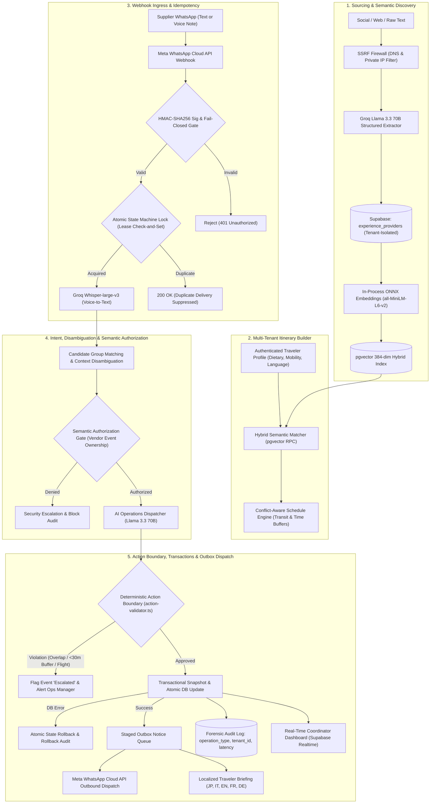

# Agentic Travel Operations: AI-Powered Supply Intelligence & Autonomous Operations Platform for DMCs

[](https://nextjs.org/)
[](https://www.typescriptlang.org/)
[](https://supabase.com/)
[](https://developers.facebook.com/docs/whatsapp/cloud-api)
[](https://groq.com/)
[](https://tailwindcss.com/)
[](LICENSE)

An enterprise-grade B2B SaaS platform engineered specifically for **Destination Management Companies (DMCs)** managing complex, multi-day itineraries and local experiential supply.

**Agentic Travel Operations** bridges the gap between fragmented local experience creators scattered across social media and the high-stakes operational realities of running live multi-day tourist itineraries. It eliminates manual firefighting by combining **unstructured supplier extraction**, **hybrid semantic vector search**, **natural conversational WhatsApp dispatching**, and an **autonomous self-healing operations engine** with deterministic safety boundaries that absorbs delays and prevents schedule collapse before travelers are affected.

---

## The Operational Reality: Why Traditional DMC Operations Fail

Destination Management Companies (DMCs) manage high-value, bespoke travel itineraries in rapidly expanding cultural and luxury travel markets. However, the operational backbone of most DMCs remains trapped in manual, error-prone workflows:

1. **Fragmented Supplier Discovery:** Authentic local experience creators (stargazing astronomers, mountain guides, coastal captains, boutique culinary artisans) do not exist on traditional Global Distribution Systems (GDS) or corporate booking extranets. They operate primarily on Instagram, TikTok, and direct messaging, making supplier sourcing, verification, and capacity tracking highly fragmented.
2. **The "WhatsApp Phone-Tag" Bottleneck:** Independent local suppliers rarely adopt complex supplier portals or extranets. Operations coordinators spend hours sending manual chat messages and exchanging voice notes to negotiate availability, confirm guest counts, and relay special requests.
3. **The 45-Minute Delay Cascade:** Premium experiential itineraries involve substantial transit times between boutique lodges, remote heritage sites, and dining venues. When a morning excursion runs 90 minutes late, a coordinator must scramble to make multiple frantic phone calls: push back lunch, alert the afternoon guide, reschedule sunset viewpoints, and shift dinner reservations. By the time the coordinator finishes making calls, travelers are already waiting, suppliers are frustrated, and schedules collapse.

**Agentic Travel Operations** was architected to replace this chaotic firefighting cycle with **an autonomous, WhatsApp-native operations engine**.

---

## Architectural Workflow & Data Flow



---

## Core System Capabilities

### 1. Unstructured Supplier Discovery & Hybrid Vector Search
- **Instant Entity Extraction:** Ingests unstructured supplier bios, brochures, WhatsApp messages, or scraped web pages, extracting commercial names, verified guest capacities, operating destinations, experience types, and phone numbers.
- **Zero-Latency Local Embeddings:** Utilizes an in-process `@xenova/transformers` ONNX pipeline (`Xenova/all-MiniLM-L6-v2`) generating 384-dimensional dense vectors in **26ms** locally without paid external embedding APIs.
- **Supabase `pgvector` Hybrid Search:** Combines dense cosine semantic vectors with full-text SQL matching to rank local suppliers based on traveler interests (e.g., matching "authentic culinary storytelling" or "night desert astronomy" to top-ranked local hosts).

### 2. Constraint-Aware Smart Itinerary Builder
- **Sanity & Constraint Validation:** Real-time checking of transit buffers, opening hours, and logical geographic sequencing across travel destinations.
- **Dietary & Accessibility Safeguards:** Explicitly checks and enforces traveler restrictions, including dietary preferences, food allergies, and wheelchair or mobility requirements.
- **Interactive Drag-and-Drop:** Intuitive timeline re-ordering with minute-level start/end time editing and auto-cascading schedule adjustments.

### 3. WhatsApp-Native Conversational Booking & Voice Intelligence
- **No Robotic Menus:** Dispatches natural, polite, and culturally attuned conversational WhatsApp booking inquiries to suppliers.
- **Voice Note Comprehension:** Routes incoming WhatsApp audio notes through Groq's high-speed `whisper-large-v3` pipeline, accurately transcribing colloquial voice notes in milliseconds.
- **Multi-Group Disambiguation:** When a supplier manages multiple groups on the same date (e.g., a morning group currently running vs. an upcoming afternoon VIP delegation), the system analyzes temporal clues, group sizes, and nationalities or opens a conversational clarification loop rather than making blind assumptions.

### 4. Autonomous Operations Center (Deterministic Schedule Cascades)
- **Automatic Disruption Handling:** When a vendor reports a delay or breakdown, the AI Operations Orchestrator:
  1. Quantifies delay magnitude and identifies every subsequent downstream booking in the day's chain.
  2. Recalculates start and end times to eliminate overlap while maintaining transit buffers.
  3. Updates `itinerary_events` in Supabase with updated timestamps and escalation tags.
  4. Automatically drafts and dispatches a warm, conversational WhatsApp notice to downstream vendors, confirming their readiness at the revised time.
- **Multilingual Tour Leader Notifications:** Generates real-time, culturally reassuring updates translated into the traveler group's native language (**Japanese**, **Italian**, **English**, **French**, **German**) so tour leaders can proactively brief guests before frustration occurs.

### 5. Predictive Regional Demand Forecasting (`/forecasting`)
- **Macro Seasonal Intelligence:** Real-time forecasting of visitor surges, capacity pressure scores (1–100), and pricing spikes across regional tourism hubs, high seasons, and festival peaks.
- **Supply Bottleneck Warnings:** Proactively flags critical shortages (specialized 4x4 fleets, licensed multilingual cultural guides, boutique accommodations) with specific advance procurement actions.
- **Custom AI Scenario Simulation:** Allows planners to input custom simulation prompts (e.g. *"A delegation of 40 VIP travelers arriving during peak season requesting private stargazing"*) and receive instant operational risk evaluations.

### 6. Post-Trip Incident Post-Mortems & Supplier Analytics (`/analytics`)
- **Live Database Auditing:** Directly inspects live Supabase event histories, calculating real-world disruption rates and autonomous self-healing metrics.
- **Supplier Reliability Scorecards:** Rates suppliers into standardized tiers (**Tier 1 Excellent**, **Tier 2 Reliable**, **Watchlist**, **Needs Improvement**) with qualitative evaluations of WhatsApp responsiveness and punctuality.
- **Recurring Issue Root Cause Analysis:** Categorizes systemic operational friction points (transit bottlenecks, guide language mismatches, sudden weather contingencies) and defines actionable SLA clauses for DMC procurement.

---

## Architectural Comparison & Design Goals

| Operational Dimension | Traditional Manual Operations | Autonomous DMC Engine Target | Architectural Safeguard |
| :--- | :--- | :--- | :--- |
| **Disruption Recovery** | 35 – 50 mins of manual phone calls | Sub-second deterministic cascade | Action Boundary verifies bounds & 30m transit buffers |
| **Downstream Notice** | Often forgotten or relayed late | Automated outbox WhatsApp dispatch | Staged Outbox prevents notice loss on worker error |
| **Supplier Adoption** | High friction (portals / apps) | Zero friction (100% WhatsApp chat/audio) | Groq Whisper + Dialect-aware intent parsing |
| **Schedule Integrity** | Manual inspection on spreadsheets | Automated chronological timeline checks | Rejects overlaps (`end > next.start`) & tight buffers |
| **Guest Communication** | Delayed, reactive notifications | Proactive multi-language traveler briefings | Localized notification generation (JP, IT, EN, FR, DE) |
| **Supplier Discovery** | Hours browsing social channels | < 30ms local ONNX vector ranking | Tenant-isolated hybrid semantic vector search |

---

## Tech Stack & Architecture Standards

```
├── Framework:        Next.js 16 (App Router, Server Components, Route Handlers)
├── Language:         TypeScript 5 (Strict Mode, 100% Type-Safe)
├── Database:         PostgreSQL 17 via Supabase with pgvector extension
├── Security:         Strict Multi-Tenant Row Level Security (RLS) on all tables
├── AI Engine:        Groq API (Llama 3.3 70B Versatile + Llama 3.1 8B Instant)
├── Audio Inference:  Groq Whisper-large-v3 (Ultra-low latency audio & voice transcription)
├── Vector Embeddings: In-Process ONNX WebAssembly via @xenova/transformers (all-MiniLM-L6-v2)
├── Messaging:        Meta WhatsApp Cloud API (Graph API v21.0, Webhook Verification)
├── Styling:          Tailwind CSS v4 + Lucide React Icons
```

### Database Security & Multi-Tenancy
Every table (`organizations`, `experience_providers`, `itineraries`, `itinerary_events`) enforces strict multi-tenancy:
- Every table has a non-nullable `tenant_id UUID`.
- Row Level Security (RLS) is enabled with non-bypassable policies:
  ```sql
  CREATE POLICY "tenant_isolation_select" ON public.itinerary_events
    FOR SELECT USING (tenant_id = auth.uid());
  ```
- Fast vector similarity is enabled via pgvector indexing:
  ```sql
  CREATE INDEX idx_experience_providers_embedding 
    ON public.experience_providers 
    USING ivfflat (embedding vector_cosine_ops);
  ```

---

## AI Safety Boundaries & Governance Architecture

Unlike generic LLM wrappers that directly execute raw model outputs against production databases, this platform enforces a multi-layer deterministic safety perimeter:

1. **Deterministic Action Boundary (`action-validator.ts`):**
   - **Timeline Overlap Prevention:** Automatically sorts day timelines and rejects changes where `current.endMins > next.startMins`.
   - **Transit Buffer Enforcement:** Mandates a minimum 30-minute operational transit buffer between consecutive events.
   - **Immutable Event Protection:** Automatically detects flights, border crossings, and high-speed rail connections, forbidding AI time mutations on locked bookings.
   - **Single-Day Blast Radius Control:** Forbids cross-day cascading adjustments, routing complex disruptions to human operations coordinators.

2. **Semantic Authorization Boundary:**
   - Enforces supplier verification: incoming vendor messages can only trigger mutations on events explicitly mapped to that vendor's identity.

3. **Distributed State-Machine Idempotency (`idempotency.ts`):**
   - Manages webhook lifecycle transitions (`received` &rarr; `processing` &rarr; `completed` / `failed`).
   - Leases in-flight locks with auto-recovery for transient worker crashes and retry capabilities on errors.

4. **Forensic Audit Logging (`audit-log.ts`):**
   - Persists immutable operation records capturing `operationType`, `tenantId`, `triggerMessageId`, `llmModel`, and `latencyMs`.

5. **Automated Test Harness (`vitest`):**
   - 32 rigorous unit and integration tests verifying cryptographic webhook signatures, SSRF firewall blocks, action boundary validation, idempotency state transitions, and real end-to-end webhook execution.
   ```bash
   npm test
   ```

---

## Benchmark Methodology & Latency Profile

To maintain engineering rigor, operational benchmarks are measured across both automated integration suites (`tests/`) and end-to-end component profiling:

| Pipeline Stage | Component / Technology | Evaluated Latency | Purpose & Boundary Guarantee |
| :--- | :--- | :--- | :--- |
| **Ingress & Security** | `crypto.timingSafeEqual` HMAC-SHA256 | `< 3 ms` | Constant-time validation; rejects forged payloads with 401 |
| **Voice Processing** | Groq `whisper-large-v3` API | `~800 ms – 1.2 s` | Fast Arabic colloquial audio transcription to structured text |
| **Vector Search** | In-process ONNX (`all-MiniLM-L6-v2`) | `~26 ms` | Zero-network local embedding generation for pgvector |
| **Intent & Disambiguation** | Groq `llama-3.3-70b-versatile` | `~650 ms – 950 ms` | Identifies affected group, delay minutes, and cascade impact |
| **Action Boundary** | `action-validator.ts` (Zod + Math) | `< 1 ms` | Deterministic verification: 0 overlaps, $\ge$ 30m transit buffer |
| **Atomic DB Mutation** | Supabase PostgreSQL + Snapshot | `< 20 ms` | State snapshotting with rollback on update error |
| **Durable Outbox Staging** | `notification_outbox` Table Insert | `< 25 ms` | Persists downstream notices as `pending` before dispatch |
| **Outbox WhatsApp Worker** | Meta Graph API v21.0 Dispatch | `~300 ms – 600 ms` | Asynchronously delivers vendor notice and marks `dispatched` |
| **Forensic Audit Log** | `agent_audit_log` Table Insert | `< 15 ms` | Immutable telemetry record of operation, model, and latency |
| **Total Incident Lifecycle** | Webhook Ingress &rarr; Dispatched Notice | **~2.1 s – 3.4 s** | Automated resolution vs. 35 – 50 mins of manual phone calls |

### Autonomous Resolution Boundary Conditions
The platform defines strict guardrails for what can be resolved autonomously versus what triggers immediate escalation to human coordinators:
- **Autonomous Scope:** Single-day operational schedule shifts $\le$ 240 minutes where downstream events can be cascaded while maintaining a minimum 30-minute transit buffer.
- **Mandatory Human Escalation:** Triggered automatically if:
  1. A disruption would push an activity outside operational hours (06:00 – 23:45).
  2. Any immutable booking (e.g. flight departure, train, border transit) is impacted.
  3. The time shift creates an unavoidable overlap with another confirmed supplier.
  4. The inbound supplier voice note remains ambiguous between multiple running groups after conversational clarification.

---

## Project Directory Structure

```
Agentic-Travel-Operations/
├── src/
│   ├── app/
│   │   ├── page.tsx                     # Smart Itinerary Builder & Live Operations Center
│   │   ├── providers/page.tsx           # AI Supplier Discovery & Extraction Engine
│   │   ├── forecasting/page.tsx         # Predictive Regional Tourism Demand Forecasting
│   │   ├── analytics/page.tsx           # Post-Trip Incident & Supplier Performance Analytics
│   │   ├── deck/page.tsx                # Clean LTR Product Deck & Printable Solution Brief
│   │   └── api/
│   │       ├── ai/
│   │       │   ├── forecasting/route.ts # Live Llama 3.3 70B Regional Demand Endpoint
│   │       │   └── analytics/route.ts   # Live Supabase Post-Mortem & Scorecard Endpoint
│   │       ├── webhooks/whatsapp/route.ts # WhatsApp Webhook (Disambiguation + Cascade)
│   │       ├── itineraries/route.ts     # Itinerary CRUD with Supabase Realtime
│   │       └── providers/
│   │           ├── discover/route.ts    # Unstructured Extraction Pipeline
│   │           └── match/route.ts       # pgvector Hybrid Semantic Search
│   ├── components/
│   │   ├── itinerary/
│   │   │   ├── SmartItineraryBuilder.tsx # Master Orchestration Component
│   │   │   ├── TimelineView.tsx          # Dual Ops & Multilingual Notification Timeline
│   │   │   ├── SmartMatchPanel.tsx       # Semantic Supplier Matching Drawer
│   │   │   └── TravelerProfileSidebar.tsx # Dietary, Mobility & Nationality Context
│   │   └── layout/
│   │       └── AppNavbar.tsx             # Multi-tenant Header with Live Routing
│   └── lib/
│       ├── agent/
│       │   ├── action-validator.ts       # Deterministic Schedule & Buffer Validation Boundary
│       │   └── audit-log.ts              # Forensic Audit Logging & DB Durability Tracker
│       ├── security/
│       │   └── ssrf.ts                   # DNS & IP Validation Firewall for Web Ingestion
│       ├── ai/
│       │   ├── llm-client.ts             # Multi-Model Cascade (Groq / Local / OpenAI)
│       │   ├── embeddings.ts             # Local In-Process ONNX Vector Generator (384-dim)
│       │   └── extraction.ts             # Structured Supplier Profile Zod Schema Parser
│       ├── whatsapp/
│       │   ├── orchestrator.ts           # Autonomous AI Operations Dispatcher (Self-Healing)
│       │   ├── outbox.ts                 # Durable Database Notification Outbox & Worker
│       │   ├── intent.ts                 # Multi-Group Disambiguation & Arabic Intent Engine
│       │   ├── idempotency.ts            # Distributed State-Machine Webhook Idempotency
│       │   ├── transcription.ts          # Groq Whisper-large-v3 Audio Processing
│       │   └── sender.ts                 # Meta Cloud API Human-Like Text Dispatcher
│       └── supabase/
│           ├── client.ts                 # Browser Client with Realtime Subscription
│           └── server.ts                 # Authenticated Server Client with Tenant Session Forwarding
├── tests/
│   ├── action-validator.test.ts          # Tests for Overlaps, Transit Buffers & Immutable Bookings
│   ├── e2e-orchestration.test.ts         # End-to-End Orchestration Contract & Authorization Tests
│   ├── e2e-webhook-pipeline.test.ts      # Full Pipeline Test from Webhook Ingress to Outbox & Audit
│   ├── idempotency.test.ts               # Tests for Distributed Lock & Retry State Machine
│   ├── ssrf.test.ts                      # Tests for DNS Resolution & Private IP Blocking
│   └── webhook-security.test.ts          # Tests for HMAC-SHA256 Signatures & Timing Safe Comparison
└── public/
    └── Agentic_Travel_Operations.html    # Standalone Print-Ready Pitch Document
```

---

## Quickstart & Local Setup

### 1. Clone & Install Dependencies
```bash
git clone https://github.com/MohammedNeana/Agentic-Travel-Operations.git
cd Agentic-Travel-Operations
npm install
```

### 2. Environment Variables Setup
Create a `.env.local` file in the root directory:

```env
# Supabase Configuration
NEXT_PUBLIC_SUPABASE_URL=https://your-project.supabase.co
NEXT_PUBLIC_SUPABASE_ANON_KEY=your-supabase-anon-key

# Groq API Configuration (Fast Inference & Whisper)
GROQ_API_KEY=gsk_your_groq_api_key

# Meta WhatsApp Cloud API Configuration
WHATSAPP_VERIFY_TOKEN=your_custom_webhook_verify_token
WHATSAPP_ACCESS_TOKEN=your_meta_system_user_token
WHATSAPP_PHONE_NUMBER_ID=your_whatsapp_phone_number_id

# (Optional) OpenAI Backup Key
OPENAI_API_KEY=sk-proj-your_openai_backup_key

# (Optional) Local LLM Integration (Ollama or LM Studio)
# LOCAL_LLM_URL=http://localhost:11434/v1/chat/completions
# LOCAL_LLM_MODEL=llama3.2
```

### 3. Run the Development Server
```bash
npm run dev
```
Open [http://localhost:3000](http://localhost:3000) to access the platform.

### 4. Key Route Endpoints:
- **Itinerary Builder & Operations:** `http://localhost:3000`
- **Supplier Discovery Engine:** `http://localhost:3000/providers`
- **Predictive Demand Forecasting:** `http://localhost:3000/forecasting`
- **Supplier Performance & Analytics:** `http://localhost:3000/analytics`
- **Executive Solution Deck & Pitch:** `http://localhost:3000/deck`

---

## Author & Engineering Background

**Mohammed Neanaa**  
*Senior Software & Agentic AI Systems Engineer*  
- **Email:** [mohammedneana@gmail.com](mailto:mohammedneana@gmail.com)  
- **LinkedIn:** [linkedin.com/in/mohammedneanaa](https://www.linkedin.com/in/mohammed-hamdi-b80442145/)  
- **GitHub:** [github.com/mohammedneana](https://github.com/MohammedNeana)  

---

## License
This project is open-source under the [MIT License](LICENSE).
