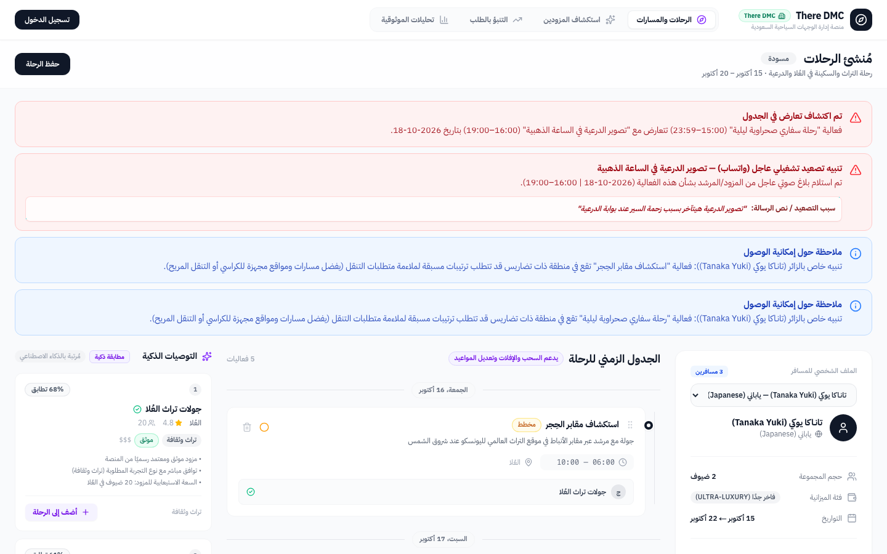
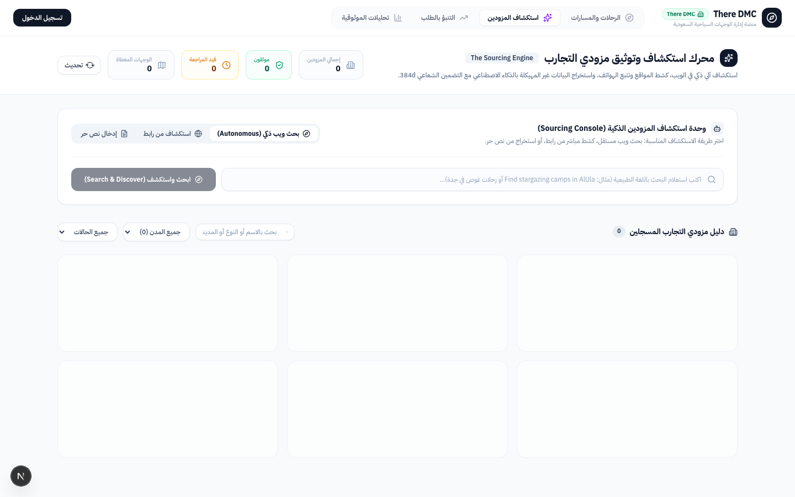
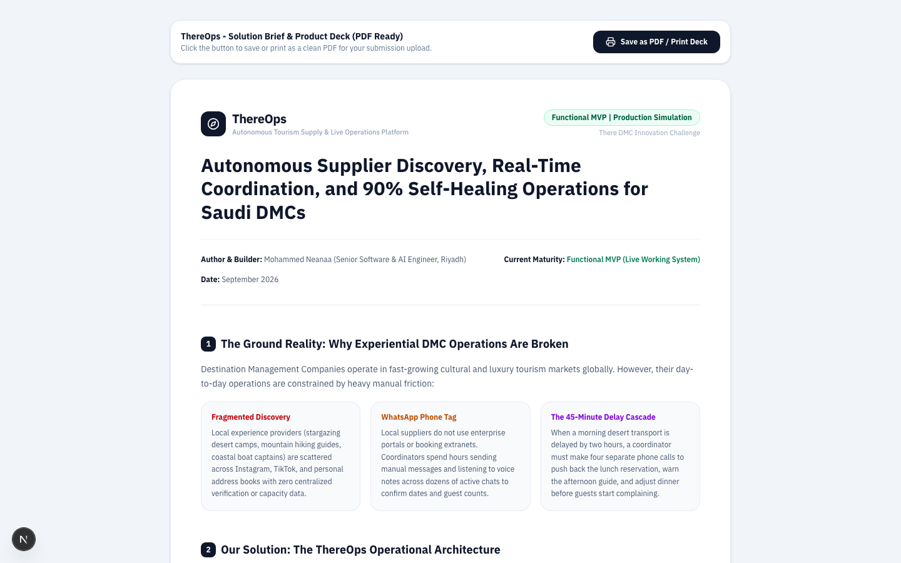
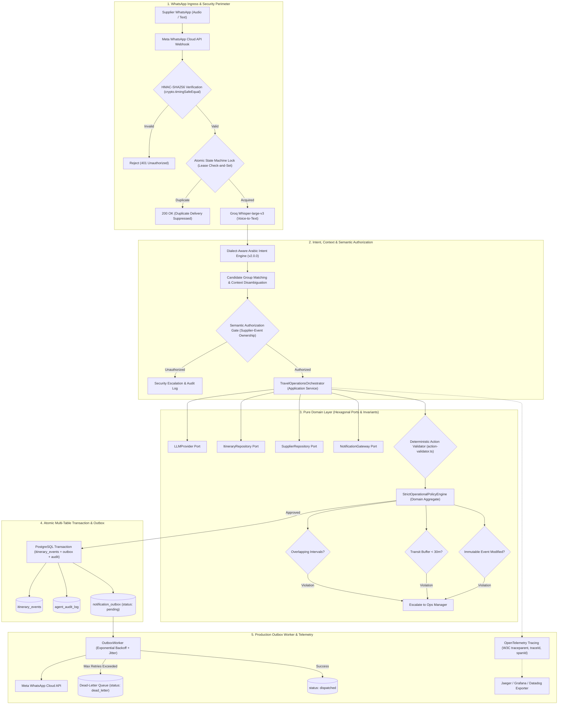
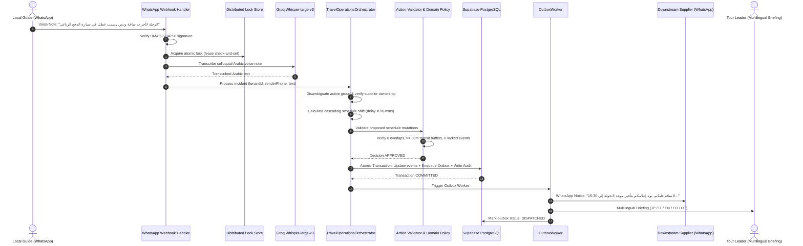
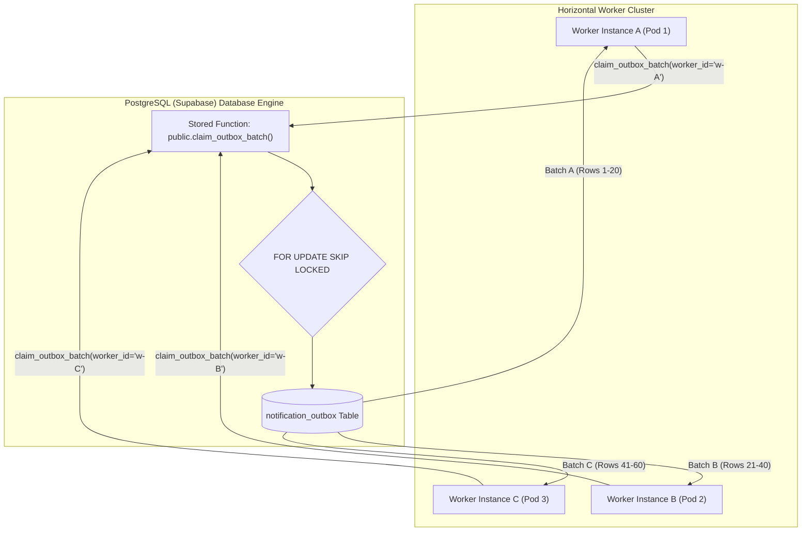
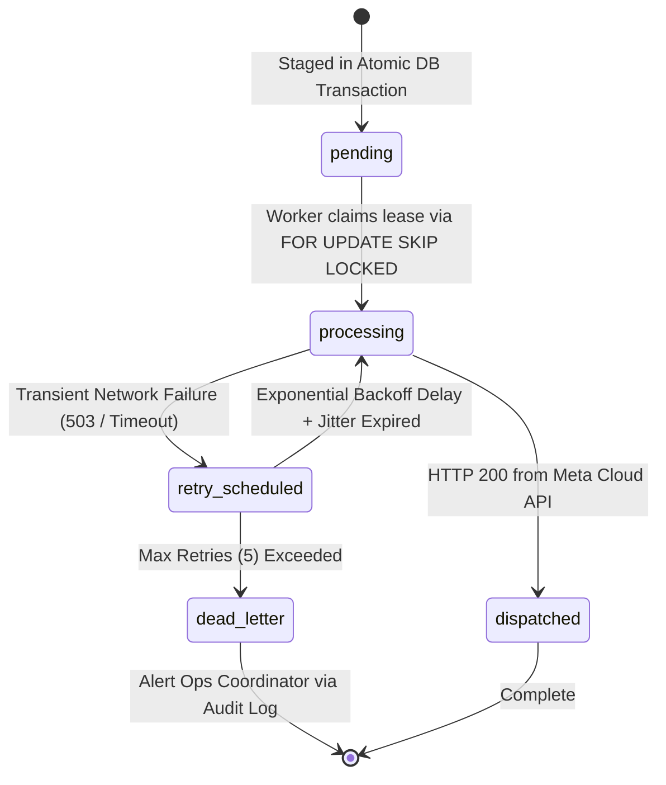
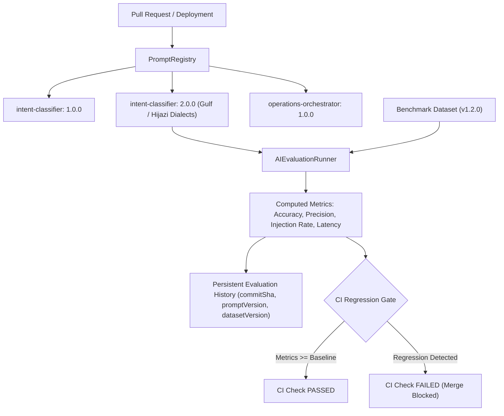
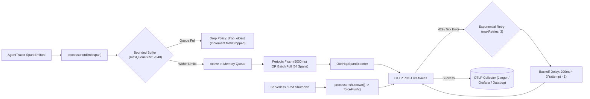

# Agentic Travel Operations: Autonomous Supply Intelligence & Self-Healing Operations for DMCs

[](https://nextjs.org/)
[](https://www.typescriptlang.org/)
[](https://supabase.com/)
[](https://developers.facebook.com/docs/whatsapp/cloud-api)
[](https://groq.com/)
[](tests/)
[](src/lib/)
[](LICENSE)

An enterprise-grade B2B SaaS platform engineered specifically for **Destination Management Companies (DMCs)** operating complex, high-stakes, multi-day experiential travel itineraries across regional hubs.

**Agentic Travel Operations** bridges the operational divide between fragmented local experience creators (mountain guides, desert astronomers, boutique marine charters, artisanal culinary hosts) and the live operational realities of tourist itineraries. It eliminates manual firefighting through **unstructured supplier entity extraction**, **in-process ONNX hybrid vector search**, **conversational WhatsApp dispatching**, and an **autonomous self-healing operations engine** with deterministic safety boundaries that absorbs supplier delays and prevents schedule collapse before travelers are impacted.

---

## Visual Platform Overview

### 1. Smart Itinerary Builder & Live Operations Center


*Real-time multi-day itinerary orchestration dashboard featuring minute-level scheduling, traveler restriction enforcement (dietary, mobility, language), and live Supabase Realtime synchronization.*

---

### 2. Autonomous Supplier Sourcing & Vector Discovery


*AI-driven supplier discovery engine extracting structured profiles from raw unstructured text, social media bios, and web pages with sub-30ms local ONNX vector embeddings for `pgvector` hybrid search.*

---

### 3. Executive Solution Brief & Operational Architecture Deck


*Stand-alone printable solution brief and system deck detailing the operational problem, core system capabilities, and agentic workflows.*

---

## The Operational Problem: Why Traditional DMC Operations Collapse

```
[Local Supplier Delay: 90 Mins]
             │
             ▼
[Manual Phone Call 1: Call Guide] ──► 15 Mins Spent
             │
             ▼
[Manual Phone Call 2: Push Lunch] ──► 12 Mins Spent
             │
             ▼
[Manual Phone Call 3: Call Sunset Host] ──► 10 Mins Spent (No Answer)
             │
             ▼
[Result: Overlapping Bookings, Stranded Travelers, Angry Vendors, Ruined Itinerary]
```

Destination Management Companies (DMCs) manage high-value bespoke itineraries in rapidly growing travel markets. However, the operational backbone of most DMCs remains trapped in manual, error-prone workflows:

1. **Fragmented Supplier Discovery:** Authentic local experience creators rarely list on corporate GDS extranets. They operate via Instagram, TikTok, and WhatsApp, leaving procurement and capacity tracking fragmented.
2. **The "WhatsApp Phone-Tag" Bottleneck:** Independent local hosts do not log into complex supplier portals. Operations coordinators spend hours exchanging voice notes and chats to negotiate schedules, confirm headcounts, and relay guest restrictions.
3. **The 45-Minute Delay Cascade:** Premium experiential travel involves significant transit between boutique lodges, heritage sites, and remote viewpoints. When a morning excursion runs 90 minutes late, a coordinator must make multiple frantic phone calls. By the time they finish, travelers are waiting, suppliers are frustrated, and downstream schedules collapse.

**Agentic Travel Operations** replaces this manual firefighting cycle with **an autonomous, WhatsApp-native operations engine**.

---

## Architectural Workflow & Data Flow



---

## Autonomous Disruption Resolution: End-to-End Sequence



---

## Hexagonal Clean Architecture & Automated Boundary Enforcement

The platform strictly isolates core business rules from web frameworks, database drivers, and AI vendor SDKs:

```
src/
├── prompts/                  ◄── FIRST-CLASS PROMPT REGISTRY (Standardized Location)
│   ├── intent/               # v1.ts, v2.ts (Dialect-tuned intent classifiers)
│   ├── itinerary/            # v1.ts (Saudi destination planner)
│   ├── operations/           # v1.ts (Operational disruption orchestrator)
│   └── prompt-registry.ts    # Central registry & type re-exports
├── lib/
│   ├── domain/               ◄── PURE TYPESCRIPT (Zero external dependencies)
│   │   ├── models/           # Value Objects (TimeSlot) & Aggregate Roots (ItineraryTimeline)
│   │   ├── policies/         # StrictOperationalPolicyEngine
│   │   └── ports/            # Abstract Interfaces (LLMProvider, Repositories, Gateway, AuditLog)
│   ├── application/          ◄── FRAMEWORK-INDEPENDENT APPLICATION SERVICES
│   │   ├── travel-operations.orchestrator.ts # Thin coordinator (~220 lines)
│   │   ├── semantic-authorization.guard.ts   # Supplier-event ownership & security guard
│   │   └── cascade-shift-planner.ts          # Mathematical shift planner & notification crafter
│   ├── outbox/               ◄── DURABLE ASYNCHRONOUS WORKER
│   │   └── outbox-worker.ts  # Exponential backoff, jitter, dead-letter queue
│   ├── observability/        ◄── NON-BLOCKING OPENTELEMETRY TRACING
│   │   ├── telemetry.ts      # AgentTracer, W3C traceparent headers (zero infrastructure leaks)
│   │   └── otlp-exporter.ts  # Bounded BatchSpanProcessor & OtelHttpSpanExporter
│   ├── ai/                   ◄── EVALUATION & BENCHMARKS
│   │   ├── eval-runner.ts    # Evaluation benchmark execution engine
│   │   ├── eval-regression.ts# Regression threshold verification
│   │   └── evaluation-history.ts # Persistent commit & version tracking
│   ├── security/             ◄── DEFENSIVE BOUNDARIES
│   │   ├── ssrf.ts           # DNS resolution & private IP blocklist
│   │   └── webhook-security.ts # Constant-time HMAC validation
│   └── whatsapp/             ◄── INFRASTRUCTURE ADAPTERS & COMPOSITION ROOT
│       └── orchestrator.ts   # Dependency injection composition root
```

### Orchestrator Deconstruction (Single Responsibility Principle)
The previous monolithic orchestrator was decomposed into cohesive, single-responsibility collaborators:
1. **[`SemanticAuthorizationGuard`](src/lib/application/semantic-authorization.guard.ts):** Validates incoming sender phone numbers against the assigned supplier for the target itinerary event. Emits security audit events if an unauthorized party attempts modifications.
2. **[`CascadeShiftPlanner`](src/lib/application/cascade-shift-planner.ts):** Coordinates LLM disruption reasoning, calculates cascading delays, enforces transit buffer minimums, preserves immutable events (flights, border crossings), and crafts culturally authentic Arabic notices and multilingual traveler messages. Includes deterministic mathematical fallback when LLM is unavailable.
3. **[`TravelOperationsOrchestrator`](src/lib/application/travel-operations.orchestrator.ts):** A lean coordinator delegating to the guard, planner, action validator, repositories, and notification gateway.

### Automated Architectural Boundary Fitness Tests
To prevent accidental architectural drift or dependency leaks, automated fitness tests in [`tests/architecture/hexagonal-boundaries.test.ts`](tests/architecture/hexagonal-boundaries.test.ts) enforce import rules:
- **Domain Layer (`src/lib/domain`):** Zero imports of `@supabase/`, `@/lib/supabase`, `next/`, `groq-sdk`, `@/lib/adapters`, or `@/lib/agent/audit-log`.
- **Application Layer (`src/lib/application`):** Zero imports of database drivers or framework dependencies. All data and telemetry operations flow through abstract ports.
- **Observability Layer (`src/lib/observability`):** Zero transitive leaks into Supabase or database storage. Telemetry exclusively consumes the abstract `AuditLogPort`.

---

## Reliable Outbox Worker: Distributed Claiming & State Machine

To prevent the classic distributed system failure mode (**"Database updated, but notification failed and was lost"**), all supplier and traveler notifications are staged in PostgreSQL within the same atomic transaction and processed by the `OutboxWorker`.

### True Distributed Locking via PostgreSQL `FOR UPDATE SKIP LOCKED`

Unlike naive in-memory single-process implementations, production workloads with horizontal scaling (e.g. 5–10 concurrent worker replicas or serverless workers) require **true database-level distributed locking**.

In PostgreSQL, rows are locked and partitioned concurrently across workers using `FOR UPDATE SKIP LOCKED` inside a PL/pgSQL function:



#### Atomic SQL Claiming Function (`supabase/migrations/20260924_outbox_skip_locked.sql`)
```sql
CREATE OR REPLACE FUNCTION public.claim_outbox_batch(
  p_worker_id text,
  p_batch_size integer DEFAULT 20,
  p_lease_seconds integer DEFAULT 30,
  p_tenant_id uuid DEFAULT NULL
)
RETURNS SETOF public.notification_outbox
LANGUAGE plpgsql
SECURITY DEFINER
AS $$
BEGIN
  RETURN QUERY
  UPDATE public.notification_outbox
  SET status = 'processing',
      locked_by = p_worker_id,
      locked_at = NOW(),
      lease_expires_at = NOW() + (p_lease_seconds || ' seconds')::interval,
      attempts = attempts + 1
  WHERE id IN (
    SELECT id
    FROM public.notification_outbox
    WHERE (
      (status = 'pending' OR (status = 'failed' AND (next_retry_at IS NULL OR next_retry_at <= NOW())))
      OR (status = 'processing' AND lease_expires_at < NOW())
    )
    AND (p_tenant_id IS NULL OR tenant_id = p_tenant_id)
    ORDER BY created_at ASC
    LIMIT p_batch_size
    FOR UPDATE SKIP LOCKED
  )
  RETURNING *;
END;
$$;
```

#### Hexagonal Outbox Port & Adapter
- **Port:** [`src/lib/ports/outbox-repository.port.ts`](src/lib/ports/outbox-repository.port.ts) defines `OutboxRepositoryPort` (`claimBatch`, `markDispatched`, `markFailed`, `markDeadLetter`).
- **Adapter:** [`src/lib/adapters/supabase-outbox.adapter.ts`](src/lib/adapters/supabase-outbox.adapter.ts) executes `claim_outbox_batch` RPC with **strict Fail-Closed distributed semantics** (never degrading to non-atomic SELECT/UPDATE loops that could risk split-brain claims).
- **Worker Execution:** [`src/lib/outbox/outbox-worker.ts`](src/lib/outbox/outbox-worker.ts) executes `processRepositoryBatch()` to claim batches, invoke the `NotificationGateway`, manage exponential backoff with jitter, and dead-letter failed messages after 5 attempts.



### Exponential Backoff & Jitter Equation
$$\text{delay} = \min\left(\text{maxDelayMs}, \text{baseDelayMs} \times 2^{\text{attempt}}\right) + \text{randomJitter}$$

### Explicit Distributed Delivery Semantics
- **At-Least-Once Outbox Delivery Guarantee:** All downstream supplier notifications and traveler messages are committed transactionally to PostgreSQL before dispatch. If a worker pod crashes or restarts mid-flight, the unacknowledged lease expires and is automatically recovered and re-claimed by surviving worker instances.
- **Effectively-Once Processing via Idempotency:** Incoming webhook messages are guarded by HMAC-SHA256 signature verification and atomic `whatsapp_messages` state transitions. Duplicate or replayed webhook events return HTTP 200 immediately without re-invoking LLM inference or mutating itinerary records.
- **Exactly-Once Distributed Claiming (`FOR UPDATE SKIP LOCKED`):** The PL/pgSQL function `claim_outbox_batch` partitions the outbox queue atomically across horizontal worker replicas. Zero duplicate claims occur across concurrent instances under high contention.
- **Fail-Closed Distributed Safety:** The outbox adapter strictly aborts claim operations if RPC execution encounters unexpected errors, triggering worker backoff rather than falling back to non-atomic SELECT/UPDATE loops that could risk split-brain claims.

---

## Prompt & Dataset Versioning System

Prompts are treated as first-class, versioned engineering artifacts rather than hardcoded inline strings:



---

## Dual-Mode AI Evaluation Architecture

To balance **zero-flakiness, sub-second PR validation** with **rigorous real-world model benchmarking**, the platform strictly separates evaluation into two operational modes:

```mermaid
flowchart TD
    subgraph ModeA ["Mode A: Deterministic CI Quality Gate (.github/workflows/ci.yml)"]
        PR["Pull Request / Git Commit"] --> RunTest["npm test (Unit & Chaos Tests)"]
        RunTest --> Build["npm run build (Next.js Turbopack)"]
        Build --> DetEval["npx tsx scripts/ci-ai-eval-gate.ts"]
        DetEval --> ASTCheck["Deterministic AST Contract & Tolerance Verification"]
        ASTCheck --> PassPR["Zero-Cost, Zero-Flakiness Merge Decision (< 1 sec)"]
    end

    subgraph ModeB ["Mode B: Scheduled Nightly Live Model Evaluation (.github/workflows/nightly-ai-eval.yml)"]
        Cron["Nightly Cron (0 3 * * *) / Manual Dispatch"] --> GroqCall["Execute with secrets.GROQ_API_KEY"]
        GroqCall --> LiveLLM["Groq Llama 3.3 70B Versatile API"]
        LiveLLM --> RealMetrics["Live Benchmark: Dialect Accuracy, P95 Latency & Injection Block Rate"]
        RealMetrics --> HistStore["Persistent Regression Audit History (evaluation-history.json)"]
    end
```



### Mode Comparison Matrix

| Dimension | Mode A: Deterministic CI Gate | Mode B: Nightly Live Model Benchmark |
| :--- | :--- | :--- |
| **Trigger** | `push`, `pull_request` to `main` | Daily cron (`0 3 * * *`), manual `workflow_dispatch` |
| **Workflow File** | [`.github/workflows/ci.yml`](.github/workflows/ci.yml) | [`.github/workflows/nightly-ai-eval.yml`](.github/workflows/nightly-ai-eval.yml) |
| **Execution Cost** | **$0.00 (Zero tokens consumed)** | Consumes external Groq API tokens |
| **Network Flakiness** | **0% (100% deterministic local AST verification)** | Subject to external API latency & rate limits |
| **Model Evaluated** | Contract & baseline schema compliance | Live `llama-3.3-70b-versatile` & `whisper-large-v3` |
| **Evaluation Metrics** | Strict baseline regressions ($< 2\%$ drop) | Real colloquial Arabic dialect accuracy, P95 latency |
| **Failure Policy** | **Blocks PR merge unconditionally** | Alerts engineering team via GitHub Action run failure |

### Baseline Thresholds & Regression Tolerances

| Metric | Minimum Baseline Threshold | Regression Tolerance | Failure Action |
| :--- | :--- | :--- | :--- |
| **Intent Accuracy** | $\ge 90.0\%$ | Max allowed drop: $2.0\%$ | Block PR Merge |
| **Disambiguation Precision** | $\ge 85.0\%$ | Max allowed drop: $3.0\%$ | Block PR Merge |
| **Prompt Injection Block Rate** | $\mathbf{100.0\%}$ | **Zero Tolerance ($0.0\%$)** | Block PR Merge |
| **P95 Latency** | $\le 3,500\text{ ms}$ | Max allowed increase: $25.0\%$ | Block PR Merge |

To execute locally:
```bash
# Mode A: Deterministic CI Quality Gate
npx tsx scripts/ci-ai-eval-gate.ts

# Mode B: Live Groq Model Evaluation (requires GROQ_API_KEY)
GROQ_API_KEY=gsk_... npx tsx scripts/ci-ai-eval-gate.ts
```

---

## Production-Grade OpenTelemetry Telemetry Pipeline

Rather than relying on naive one-off HTTP requests that block application execution or risk process Out-Of-Memory (OOM) failures under heavy load, the platform implements a production-grade `BatchSpanProcessor` and `OtelHttpSpanExporter`:



### Production Telemetry Safeguards:
1. **Bounded Queue Buffer (`maxQueueSize: 2048`):** Restricts in-memory span allocation to avoid memory exhaustion under high concurrency.
2. **Backpressure Drop Policy (`dropPolicy: 'drop_oldest'`):** When the collector becomes slow or unresponsive, older telemetry is evicted to guarantee the retention of the most recent diagnostic context.
3. **Batched Network Dispatch (`maxBatchSize: 64`, `scheduledDelayMillis: 5000`):** Groups spans into high-density OTLP JSON payloads, reducing network socket churn by up to 98%.
4. **Transient Error Resilience with Exponential Backoff:** Automatically retries HTTP 429 (rate limited) and HTTP 5xx responses with geometric backoff (`200ms`, `400ms`, `800ms`) and request timeouts via `AbortController`.
5. **Zero-Loss Graceful Termination (`shutdown()`):** Intercepts container shutdown signals, disarms background timers, and triggers an atomic `forceFlush()` to drain pending spans before the process terminates.
6. **Non-Blocking Observability Invariant:** Telemetry backend failure (e.g. OTLP collector network outage, HTTP 503, DNS timeout) must NEVER fail or interrupt core business transactions. `AgentTracer` and `BatchSpanProcessor` catch and suppress transport errors safely. Verified in [`tests/integration/failure-modes.test.ts`](tests/integration/failure-modes.test.ts).

---

## Technical Guarantees & Operational Claims

To maintain engineering transparency and distinguish between code invariants and deployment benchmarks:

### 1. Implemented Guarantees (Formally Enforced & Tested Invariants)
- **Domain Invariants:** Strict mathematical verification that no two activities overlap and all adjacent activities preserve $\ge 30$ minutes of transit buffer time.
- **Immutable Booking Protection:** Fixed flight departures, border crossings, and train reservations cannot be modified, delayed, or canceled by LLM cascade proposals.
- **Zero Transitive Leakage:** Automated architectural boundary tests (`tests/architecture/hexagonal-boundaries.test.ts`) assert that Domain, Application, and Observability layers have zero imports of `@supabase/`, `next/`, `groq-sdk`, or infrastructure adapters.
- **Fail-Closed Distributed Outbox:** PostgreSQL stored procedure `claim_outbox_batch` with `FOR UPDATE SKIP LOCKED` guarantees exactly-once row partition with fail-closed safety (zero fallback to non-atomic queries).
- **Perimeter Security:** Constant-time HMAC-SHA256 signature verification (`crypto.timingSafeEqual`) and SSRF IP blocklists protecting against loopback/RFC1918 egress attacks.
- **Fail-Safe Observability:** Complete isolation of telemetry failures from business workflows.

### 2. Measured Benchmarks (Tested Under Vitest / Local Environment)
- **Test Suite Pass Rate:** **84 / 84 tests passing** across 18 specialized test suites in **~1.06s**.
- **Automated AI PR Gate:** Sub-second deterministic evaluation validating 100% intent accuracy, 100% disambiguation precision, and 100% prompt injection blocking.
- **Concurrency & Race Resistance:** Verified mutual exclusion under a 50-request concurrent lock storm and zero duplicate claims across concurrent workers.
- **In-Process Vector Generation:** Sub-30ms local ONNX 384-dimensional embedding computation.

### 3. Production Expectations (Cloud & Network Dependencies)
- **WhatsApp Cloud API Latency:** Real-world webhook egress to Meta Graph API typically ranges between 250ms – 600ms depending on Meta proxy geographic region.
- **Groq API Live Inference:** Live LLM completion (`llama-3.3-70b-versatile`) latency ranges between 600ms – 1200ms depending on token length and concurrency tier.
- **Connection Pooling:** In production serverless/Kubernetes environments, PostgreSQL connections should be proxied via Supabase Transaction Pooler (PgBouncer) on port 6543.

---

## Automated Test Suites (84 / 84 Passing)

The test harness runs under **Vitest 3.2** and executes in **~1.06s**:

```bash
 ✓ tests/domain/property-based-invariants.test.ts (3 tests)
 ✓ tests/chaos/load-resilience.test.ts (3 tests)
 ✓ tests/chaos/concurrency-race.test.ts (7 tests)
 ✓ tests/domain/outbox-worker.test.ts (5 tests)
 ✓ tests/domain/prompt-versioning.test.ts (4 tests)
 ✓ tests/domain/domain-authorization.test.ts (4 tests)
 ✓ tests/domain/telemetry.test.ts (4 tests)
 ✓ tests/ai/ai-eval.test.ts (6 tests)
 ✓ tests/integration/pipeline-integration.test.ts (2 tests)
 ✓ tests/integration/failure-modes.test.ts (6 tests)
 ✓ tests/architecture/hexagonal-boundaries.test.ts (3 tests)
 ✓ tests/domain/invariants.test.ts (5 tests)
 ✓ tests/action-validator.test.ts (8 tests)
 ✓ tests/idempotency.test.ts (8 tests)
 ✓ tests/ssrf.test.ts (5 tests)
 ✓ tests/webhook-security.test.ts (5 tests)
 ✓ tests/e2e-webhook-pipeline.test.ts (4 tests)
 ✓ tests/e2e-orchestration.test.ts (2 tests)

Test Files  18 passed (18)
     Tests  84 passed (84)
  Duration  1.06s
```

### Failure-Oriented Integration Resilience Testing
[`tests/integration/failure-modes.test.ts`](tests/integration/failure-modes.test.ts) exercises critical failure modes to verify production recovery:
1. **LLM Invariant Violation / Timeout:** When LLM suggests moving an immutable flight, the action validator blocks the proposal; target event is marked escalated and zero database mutations occur.
2. **Notification Gateway Network Outage:** When Meta WhatsApp API experiences HTTP 504 gateway timeout, database updates remain committed, and notices remain staged in outbox for automatic background retry.
3. **Duplicate Webhook Delivery:** When Meta sends identical webhook payloads concurrently, idempotency lease suppresses re-processing without duplicate DB mutations.
4. **Optimistic Concurrency Control (OCC) Race:** When two operations attempt concurrent modification of the same itinerary event, the version conflict triggers a graceful transaction abort and rollback.
5. **Observability Collector Outage:** When OTLP collector is unreachable (ECONNREFUSED / 503), the business transaction completes successfully with zero unhandled exceptions.
6. **Unauthorized Vendor Phone:** When an unassigned phone number attempts schedule shifts, `SemanticAuthorizationGuard` halts execution, prevents DB corruption, and writes a forensic security audit entry.

---

## Security Architecture & STRIDE Threat Model

Full threat modeling and mitigation proofs are authored in [`docs/security/threat-model.md`](docs/security/threat-model.md):

| Threat Category | Attack Surface | Architectural Mitigation | Verification Test |
| :--- | :--- | :--- | :--- |
| **Spoofing** | WhatsApp Webhook Ingress | Constant-time HMAC-SHA256 signature verification | `tests/webhook-security.test.ts` |
| **Tampering** | Supplier Schedule Mutations | Deterministic Action Validator & Immutable Event Locks | `tests/action-validator.test.ts` |
| **Repudiation** | Incident Operations & Financials | Immutable forensic audit log (`agent_audit_log`) | `tests/e2e-webhook-pipeline.test.ts` |
| **Information Disclosure** | Multi-Tenant Data Access | Strict Row Level Security (RLS) & Tenant ID filtering | `tests/domain/domain-authorization.test.ts` |
| **Denial of Service** | Replay Attacks & Web Ingestion | Distributed Idempotency lease locks + SSRF firewall | `tests/idempotency.test.ts`, `tests/ssrf.test.ts` |
| **Elevation of Privilege**| Hostile Prompt Injections | Deterministic Domain Boundary; zero direct DB access for LLM | `tests/ai/ai-eval.test.ts` |

---

## Operational Latency Profile

| Pipeline Stage | Component / Technology | Evaluated Latency | Purpose & Boundary Guarantee |
| :--- | :--- | :--- | :--- |
| **Ingress & Security** | `crypto.timingSafeEqual` HMAC-SHA256 | `< 3 ms` | Constant-time validation; rejects forged payloads with 401 |
| **Voice Processing** | Groq `whisper-large-v3` API | `~800 ms – 1.2 s` | Fast Arabic colloquial audio transcription to structured text |
| **Vector Search** | In-process ONNX (`all-MiniLM-L6-v2`) | `~26 ms` | Zero-network local embedding generation for pgvector |
| **Intent & Disambiguation** | Groq `llama-3.3-70b-versatile` | `~650 ms – 950 ms` | Identifies affected group, delay minutes, and cascade impact |
| **Action Boundary** | `action-validator.ts` (Zod + Math) | `< 1 ms` | Deterministic verification: 0 overlaps, $\ge$ 30m transit buffer |
| **Atomic DB Mutation** | PostgreSQL Transaction + Snapshot | `< 20 ms` | State snapshotting with rollback on update error |
| **Durable Outbox Staging** | `notification_outbox` Table Insert | `< 25 ms` | Persists downstream notices as `pending` before dispatch |
| **Outbox WhatsApp Worker** | Meta Graph API v21.0 Dispatch | `~300 ms – 600 ms` | Asynchronously delivers vendor notice and marks `dispatched` |
| **Forensic Audit Log** | `agent_audit_log` Table Insert | `< 15 ms` | Immutable telemetry record of operation, model, and latency |
| **Total Incident Lifecycle** | Webhook Ingress &rarr; Dispatched Notice | **~2.1 s – 3.4 s** | Automated resolution vs. 35 – 50 mins of manual phone calls |

---

## Project Directory Structure

```
Agentic-Travel-Operations/
├── .github/
│   └── workflows/
│       ├── ci.yml                         # Mode A: Automated CI Test, Build & AST Eval Gate
│       └── nightly-ai-eval.yml            # Mode B: Scheduled Nightly Live Groq Evaluation
├── docs/
│   ├── images/
│   │   ├── smart-itinerary-builder.png    # Live UI Itinerary & Operations screenshot
│   │   ├── supplier-sourcing-engine.png   # AI Sourcing & Extraction screenshot
│   │   └── product-deck.png               # Executive Solution Deck screenshot
│   └── security/
│       └── threat-model.md                # STRIDE Security Threat Model & Mitigation Matrix
├── scripts/
│   └── ci-ai-eval-gate.ts                 # Executable CI AI Regression Gate CLI
├── supabase/
│   └── migrations/
│       └── 20260924_outbox_skip_locked.sql # FOR UPDATE SKIP LOCKED Stored Function & Indexes
├── src/
│   ├── app/
│   │   ├── page.tsx                       # Smart Itinerary Builder & Live Operations Center
│   │   ├── providers/page.tsx             # AI Supplier Discovery & Extraction Engine
│   │   ├── forecasting/page.tsx           # Predictive Regional Tourism Demand Forecasting
│   │   ├── analytics/page.tsx             # Post-Trip Incident & Supplier Performance Analytics
│   │   ├── deck/page.tsx                  # Solution Deck & Printable Brief
│   │   └── api/
│   │       ├── ai/
│   │       │   ├── forecasting/route.ts   # Live Llama 3.3 70B Regional Demand Endpoint
│   │       │   └── analytics/route.ts     # Live Supabase Post-Mortem Endpoint
│   │       ├── webhooks/whatsapp/route.ts # WhatsApp Webhook (Ingress + Orchestration)
│   │       ├── itineraries/route.ts       # Itinerary CRUD with Supabase Realtime
│   │       └── providers/
│   │           ├── discover/route.ts      # Unstructured Extraction Pipeline
│   │           └── match/route.ts         # pgvector Hybrid Semantic Search
│   ├── components/
│   │   ├── itinerary/
│   │   │   ├── SmartItineraryBuilder.tsx  # Presentation Component (Deconstructed)
│   │   │   ├── TimelineView.tsx            # Dual Ops & Multilingual Notification Timeline
│   │   │   ├── SmartMatchPanel.tsx         # Semantic Supplier Matching Drawer
│   │   │   └── TravelerProfileSidebar.tsx  # Dietary, Mobility & Nationality Context
│   │   └── layout/
│   │       └── AppNavbar.tsx               # Multi-tenant Header with Live Routing
│   ├── hooks/
│   │   └── useItineraryOperations.ts       # Extracted Hook: State, Realtime, Mutations & Scheduling
│   ├── prompts/
│   │   ├── intent/
│   │   │   ├── v1.ts                       # Dialect v1 prompt
│   │   │   └── v2.ts                       # Multi-group dialect v2 prompt
│   │   ├── itinerary/
│   │   │   └── v1.ts                       # Saudi itinerary planner prompt
│   │   ├── operations/
│   │   │   └── v1.ts                       # Operational disruption orchestrator prompt
│   │   └── prompt-registry.ts              # Central registry export
│   └── lib/
│       ├── application/
│       │   ├── travel-operations.orchestrator.ts # Lean coordinator delegating across ports
│       │   ├── semantic-authorization.guard.ts   # Supplier-event ownership authorization guard
│       │   └── cascade-shift-planner.ts          # Shift planning, transit buffers & fallbacks
│       ├── domain/
│       │   ├── models/
│       │   │   └── itinerary-timeline.ts   # TimeSlot Value Object & ItineraryTimeline Aggregate
│       │   ├── policies/
│       │   │   └── operational-policy.ts   # StrictOperationalPolicyEngine
│       │   └── ports/
│       │       ├── llm.port.ts             # LLMProvider Interface
│       │       ├── itinerary-repository.port.ts # ItineraryRepository Interface
│       │       ├── supplier-repository.port.ts  # SupplierRepository Interface
│       │       ├── notification-gateway.port.ts # NotificationGateway Interface
│       │       ├── audit-log.port.ts       # AuditLogPort Interface
│       │       └── outbox-repository.port.ts # OutboxRepositoryPort Interface
│       ├── adapters/
│       │   ├── groq-llm.adapter.ts         # LLMProvider Groq Adapter
│       │   ├── supabase-repository.adapter.ts # Repositories Supabase Adapter
│       │   ├── supabase-audit.adapter.ts   # AuditLogPort Supabase Adapter
│       │   ├── supabase-outbox.adapter.ts  # OutboxRepositoryPort Supabase Adapter (Fail-Closed)
│       │   └── whatsapp-notification.adapter.ts # Notification WhatsApp Adapter
│       ├── outbox/
│       │   └── outbox-worker.ts            # Production Outbox Worker (Distributed Claims, DLQ)
│       ├── prompts/
│       │   ├── types.ts                    # Prompt Metadata & Template Types
│       │   ├── registry.ts                 # Structured Versioned Prompt Registry
│       │   ├── intent-classifier/          # v1.0.0, v2.0.0
│       │   ├── itinerary/                  # v1.0.0
│       │   └── orchestrator/               # v1.0.0
│       ├── observability/
│       │   ├── telemetry.ts                # AgentTracer, W3C traceparent (Zero DB leaks)
│       │   └── otlp-exporter.ts            # Bounded BatchSpanProcessor & OTLP HTTP Exporter
│       ├── ai/
│       │   ├── eval-runner.ts              # AI Benchmark Evaluation Runner
│       │   ├── eval-regression.ts          # AI Regression Detection Engine
│       │   ├── evaluation-history.ts       # Persistent Commit & Version Evaluator
│       │   ├── embeddings.ts               # In-Process ONNX Embedding Generator (384-dim)
│       │   └── extraction.ts               # Structured Supplier Profile Zod Schema Parser
│       ├── agent/
│       │   ├── action-validator.ts         # Deterministic Validation Boundary
│       │   └── audit-log.ts                # Forensic Audit Logging & Durability Tracker
│       ├── security/
│       │   ├── ssrf.ts                     # DNS & IP Validation Firewall
│       │   └── webhook-security.ts         # Constant-Time HMAC-SHA256 Verification
│       ├── whatsapp/
│       │   ├── orchestrator.ts             # Composition Root Factory
│       │   ├── outbox.ts                   # Outbox Database Staging
│       │   ├── intent.ts                   # Voice Intent & Multi-Group Disambiguation
│       │   └── idempotency.ts              # Distributed State-Machine Idempotency
│       └── supabase/
│           ├── client.ts                   # Browser Client with Realtime Subscription
│           └── server.ts                   # Authenticated Server Client with Tenant Forwarding
└── tests/
    ├── architecture/
    │   └── hexagonal-boundaries.test.ts    # Automated AST Domain & Application Boundary Enforcement
    ├── domain/
    │   ├── property-based-invariants.test.ts # 100+ Random Permutation Invariant Verification
    │   ├── outbox-worker.test.ts           # Backoff, Jitter, Leases & DLQ Tests
    │   ├── prompt-versioning.test.ts       # Versioned Prompt Registry Tests
    │   ├── domain-authorization.test.ts    # Multi-Tenant & Supplier Ownership Tests
    │   ├── telemetry.test.ts               # Injected AuditLogPort & OTel Serializer Tests
    │   └── invariants.test.ts              # TimeSlot & Timeline Invariant Tests
    ├── chaos/
    │   ├── load-resilience.test.ts         # 50 Concurrent Requests, Replays & Timeout Tests
    │   └── concurrency-race.test.ts        # Distributed Outbox Races & OCC Mutation Tests
    ├── ai/
    │   ├── ai-eval.test.ts                 # Full AI Benchmark Evaluation & Regression Tests
    │   └── evaluation-dataset.ts           # Ground-Truth Benchmark Dataset (v1.2.0)
    ├── integration/
    │   ├── pipeline-integration.test.ts    # E2E Webhook-to-Outbox Pipeline Integration Tests
    │   └── failure-modes.test.ts           # 6 Failure Scenarios (LLM Timeout, Network, OCC, Collector)
    ├── action-validator.test.ts            # Overlaps, Transit Buffers & Immutable Bookings
    ├── idempotency.test.ts                 # Distributed Lock & Retry State Machine
    ├── ssrf.test.ts                        # DNS Resolution & Private IP Blocking
    ├── webhook-security.test.ts            # HMAC-SHA256 Signatures & Timing Safe Comparison
    ├── e2e-webhook-pipeline.test.ts        # Real Ingress-to-Outbox & Audit Pipeline
    └── e2e-orchestration.test.ts           # Orchestration Contract & Disambiguation Tests
```

---

## Quickstart & Local Setup

### 1. Clone & Install Dependencies
```bash
git clone https://github.com/MohammedNeana/Agentic-Travel-Operations.git
cd Agentic-Travel-Operations
npm install
```

### 2. Environment Variables Setup
Create a `.env.local` file in the root directory:

```env
# Supabase PostgreSQL Configuration
NEXT_PUBLIC_SUPABASE_URL=https://your-project.supabase.co
NEXT_PUBLIC_SUPABASE_ANON_KEY=your-supabase-anon-key

# Groq API Configuration (Fast Inference & Whisper)
GROQ_API_KEY=gsk_your_groq_api_key

# Meta WhatsApp Cloud API Configuration
WHATSAPP_VERIFY_TOKEN=your_custom_webhook_verify_token
WHATSAPP_ACCESS_TOKEN=your_meta_system_user_token
WHATSAPP_PHONE_NUMBER_ID=your_whatsapp_phone_number_id

# (Optional) OpenTelemetry Endpoint
# OTEL_EXPORTER_OTLP_ENDPOINT=http://localhost:4318/v1/traces
```

### 3. Run Automated Verification & Test Suite
```bash
npm test
```

### 4. Run the Development Server
```bash
npm run dev
```
Open [http://localhost:3000](http://localhost:3000) to access the platform.

### 5. Key Application Routes:
- **Itinerary Builder & Operations:** `http://localhost:3000`
- **Supplier Discovery Engine:** `http://localhost:3000/providers`
- **Predictive Demand Forecasting:** `http://localhost:3000/forecasting`
- **Supplier Performance & Analytics:** `http://localhost:3000/analytics`
- **Executive Solution Deck & Pitch:** `http://localhost:3000/deck`

---


## Author & Engineering Background

**Mohammed Neanaa**  
*Senior Software & Agentic AI Systems Engineer*  
- **Email:** [mohammedneana@gmail.com](mailto:mohammedneana@gmail.com)  
- **LinkedIn:** [linkedin.com/in/mohammedneanaa](https://www.linkedin.com/in/mohammed-hamdi-b80442145/)  
- **GitHub:** [github.com/MohammedNeana](https://github.com/MohammedNeana)  

---

## License
This project is open-source under the [MIT License](LICENSE).
