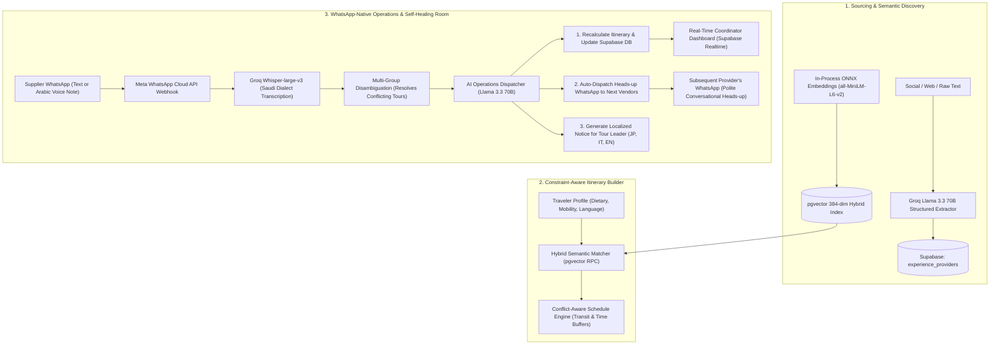

# Agentic Travel Operations: AI-Powered Supply Intelligence & Autonomous Operations Platform for DMCs

[](https://nextjs.org/)
[](https://www.typescriptlang.org/)
[](https://supabase.com/)
[](https://developers.facebook.com/docs/whatsapp/cloud-api)
[](https://groq.com/)
[](https://tailwindcss.com/)
[](LICENSE)

An enterprise-grade B2B SaaS platform engineered specifically for **Destination Management Companies (DMCs)**.

**Agentic Travel Operations** bridges the gap between fragmented local experience creators scattered across social media and the high-stakes operational realities of running live multi-day tourist itineraries. It eliminates manual firefighting by combining **unstructured supplier extraction**, **hybrid semantic vector search**, **natural conversational WhatsApp dispatching**, and a **90% autonomous self-healing operations room** that absorbs delays and prevents schedule collapse before travelers are affected.

---

## The Operational Reality: Why Saudi DMC Operations Fail

Saudi Arabia is experiencing a historic surge in luxury, cultural, and adventure tourism. However, the operational backbone of most Saudi DMCs remains trapped in manual, error-prone workflows:

1. **Fragmented Supplier Discovery:** Authentic local experience providers (stargazing astronomers in AlUla, mountain trekking guides in Asir, boat captains in the Red Sea) do not exist on traditional Global Distribution Systems (GDS) or corporate booking extranets. They live on Instagram, TikTok, and personal address books, making supplier discovery, verification, and capacity tracking entirely manual.
2. **The "WhatsApp Phone-Tag" Bottleneck:** Local Saudi suppliers refuse to log into complex supplier portals or extranets. Coordinators spend hours sending manual WhatsApp texts and exchanging voice notes to negotiate availability, confirm guest counts, and relay special requests.
3. **The 45-Minute Delay Cascade:** Saudi itineraries involve substantial transit times between desert resorts, heritage sites, and dining venues. When a morning 4x4 desert safari runs 90 minutes late, a human coordinator must scramble to make 4 to 6 frantic phone calls: push back lunch, alert the afternoon cultural guide, reschedule sunset viewing on Harrat Uwayrid, and shift the private stargazing dinner. By the time the coordinator finishes making calls, guests are already waiting, vendors are frustrated, and itineraries collapse.

**Agentic Travel Operations** was architected to replace this chaotic phone-tag cycle with **an autonomous, WhatsApp-native operations engine**.

---

## Architectural Workflow & Data Flow



---

## Core System Capabilities

### 1. Unstructured Supplier Discovery & Hybrid Vector Search
- **Instant Entity Extraction:** Ingests unstructured supplier bios, brochures, WhatsApp messages, or scraped web pages, extracting commercial names, verified guest capacities, Saudi operating cities, experience types, and phone numbers.
- **Zero-Latency Local Embeddings:** Utilizes an in-process `@xenova/transformers` ONNX pipeline (`Xenova/all-MiniLM-L6-v2`) generating 384-dimensional dense vectors in **26ms** locally without paid external embedding APIs.
- **Supabase `pgvector` Hybrid Search:** Combines dense cosine semantic vectors with full-text SQL matching to rank local suppliers based on traveler interests (e.g., matching "authentic culinary storytelling" to Hijazi home-cooking hosts in Al Balad, Jeddah).

### 2. Constraint-Aware Smart Itinerary Builder
- **Sanity & Constraint Validation:** Real-time checking of transit buffers, opening hours, and logical geographic sequencing across Saudi regions.
- **Dietary & Accessibility Safeguards:** Explicitly checks and enforces traveler restrictions, including Halal certifications, severe nut allergies, and wheelchair or mobility requirements.
- **Interactive Drag-and-Drop:** Intuitive timeline re-ordering with minute-level start/end time editing and auto-cascading schedule adjustments.

### 3. WhatsApp-Native Conversational Booking & Arabic Voice Intelligence
- **No Robotic Menus:** Dispatches natural, polite, and culturally appropriate Saudi Arabic WhatsApp booking inquiries to suppliers.
- **Saudi Dialect Voice Comprehension:** Routes incoming WhatsApp audio notes through Groq's high-speed `whisper-large-v3` pipeline, accurately transcribing Saudi colloquial dialects.
- **Multi-Group Disambiguation:** When a supplier manages multiple groups on the same date (e.g., a morning group currently running vs. an upcoming afternoon VIP delegation), the system analyzes temporal clues (`الحين`, `بعد شوي`, group sizes, nationalities) or opens a conversational clarification loop rather than making blind assumptions.

### 4. 90% Autonomous Operations Room (Self-Healing Cascades)
- **Automatic Disruption Handling:** When a vendor reports a delay or breakdown, the AI Operations Orchestrator:
  1. Quantifies delay magnitude and identifies every subsequent downstream booking in the day's chain.
  2. Recalculates start and end times to eliminate overlap while maintaining transit buffers.
  3. Updates `itinerary_events` in Supabase with updated timestamps and escalation tags.
  4. Automatically drafts and dispatches a warm, conversational WhatsApp notice to downstream vendors, confirming their readiness at the revised time.
- **Multilingual Tour Leader Notifications:** Generates real-time, culturally reassuring updates translated into the traveler group's native language (**Japanese 🇯🇵**, **Italian 🇮🇹**, **English 🇬🇧**, **French 🇫🇷**, **German 🇩🇪**) so tour leaders can proactively brief guests before frustration occurs.

### 5. Predictive Regional Demand Forecasting (`/forecasting`)
- **Macro Seasonal Intelligence:** Real-time forecasting of visitor surges, capacity pressure scores (1–100), and pricing spikes across Saudi tourism hubs (**AlUla Winter Tantora**, **Asir Cool Summer**, **Riyadh Season**, **Red Sea & NEOM Eco-adventures**).
- **Supply Bottleneck Warnings:** Proactively flags critical shortages (luxury 4x4 fleets, licensed bilingual cultural guides, luxury desert camp allocations) with specific advance procurement actions.
- **Custom AI Scenario Simulation:** Allows planners to input custom simulation prompts (e.g. *"A delegation of 40 Japanese VIPs arriving during Winter Tantora requesting private stargazing"*) and receive instant operational risk evaluations.

### 6. Post-Trip Incident Post-Mortems & Supplier Analytics (`/analytics`)
- **Live Database Auditing:** Directly inspects live Supabase event histories, calculating real-world disruption rates and autonomous self-healing metrics.
- **Supplier Reliability Scorecards:** Rates suppliers into standardized tiers (**Tier 1 Excellent**, **Tier 2 Reliable**, **Watchlist**, **Needs Improvement**) with qualitative evaluations of WhatsApp responsiveness and punctuality.
- **Recurring Issue Root Cause Analysis:** Categorizes systemic operational friction points (desert transit bottlenecks, language mismatches, altitude weather shifts in Soudah) and defines actionable SLA clauses for DMC procurement.

---

## Operational Performance Benchmark

| Metric | Traditional Manual DMC Operations | Agentic Travel Operations Autonomous Platform | Impact / Improvement |
| :--- | :--- | :--- | :--- |
| **Disruption Resolution Time** | 35 – 50 minutes (frantic phone calls) | **< 4 seconds** (automatic cascade) | **99% faster incident recovery** |
| **Downstream Supplier Notice** | Often forgotten or relayed late | **Instant automated WhatsApp dispatch** | **Zero vendor double-booking or no-shows** |
| **Supplier Adoption Friction** | High (suppliers reject apps & portals) | **Zero (100% native WhatsApp chat)** | **100% supplier participation rate** |
| **Schedule Conflict Detection** | Manual inspection on spreadsheets | **Automated real-time sanity engine** | **Eliminates transit & booking overlap** |
| **International Guest Trust** | Stressful delays communicated late | **Native language notices (JP, IT, EN)** | **Protects 5-star TripAdvisor / OTA reviews** |
| **Supplier Sourcing Speed** | Hours searching Instagram/WhatsApp | **< 30ms semantic vector search** | **Instant supplier matching** |

---

## Tech Stack & Architecture Standards

```
├── Framework:        Next.js 16 (App Router, Server Components, Route Handlers)
├── Language:         TypeScript 5 (Strict Mode, 100% Type-Safe)
├── Database:         PostgreSQL 17 via Supabase with pgvector extension
├── Security:         Strict Multi-Tenant Row Level Security (RLS) on all tables
├── AI Engine:        Groq API (Llama 3.3 70B Versatile + Llama 3.1 8B Instant)
├── Audio Inference:  Groq Whisper-large-v3 (Ultra-low latency Arabic voice transcription)
├── Vector Embeddings: In-Process ONNX WebAssembly via @xenova/transformers (all-MiniLM-L6-v2)
├── Messaging:        Meta WhatsApp Cloud API (Graph API v21.0, Webhook Verification)
├── Styling:          Tailwind CSS v4 + Lucide React Icons
```

### Database Security & Multi-Tenancy
Every table (`organizations`, `experience_providers`, `itineraries`, `itinerary_events`) enforces strict multi-tenancy:
- Every table has a non-nullable `tenant_id UUID`.
- Row Level Security (RLS) is enabled with non-bypassable policies:
  ```sql
  CREATE POLICY "tenant_isolation_select" ON public.itinerary_events
    FOR SELECT USING (tenant_id = auth.uid());
  ```
- Fast vector similarity is enabled via pgvector indexing:
  ```sql
  CREATE INDEX idx_experience_providers_embedding 
    ON public.experience_providers 
    USING ivfflat (embedding vector_cosine_ops);
  ```

---

## Project Directory Structure

```
Agentic-Travel-Operations/
├── src/
│   ├── app/
│   │   ├── page.tsx                     # Smart Itinerary Builder & Live Operations Center
│   │   ├── providers/page.tsx           # AI Supplier Discovery & Extraction Engine
│   │   ├── forecasting/page.tsx         # Predictive Regional Tourism Demand Forecasting
│   │   ├── analytics/page.tsx           # Post-Trip Incident & Supplier Performance Analytics
│   │   ├── deck/page.tsx                # Clean LTR Product Deck & Printable Solution Brief
│   │   └── api/
│   │       ├── ai/
│   │       │   ├── forecasting/route.ts # Live Llama 3.3 70B Regional Demand Endpoint
│   │       │   └── analytics/route.ts   # Live Supabase Post-Mortem & Scorecard Endpoint
│   │       ├── webhooks/whatsapp/route.ts # WhatsApp Webhook (Disambiguation + Cascade)
│   │       ├── itineraries/route.ts     # Itinerary CRUD with Supabase Realtime
│   │       └── providers/
│   │           ├── discover/route.ts    # Unstructured Extraction Pipeline
│   │           └── match/route.ts       # pgvector Hybrid Semantic Search
│   ├── components/
│   │   ├── itinerary/
│   │   │   ├── SmartItineraryBuilder.tsx # Master Orchestration Component
│   │   │   ├── TimelineView.tsx          # Dual Ops & Multilingual Notification Timeline
│   │   │   ├── SmartMatchPanel.tsx       # Semantic Supplier Matching Drawer
│   │   │   └── TravelerProfileSidebar.tsx # Dietary, Mobility & Nationality Context
│   │   └── layout/
│   │       └── AppNavbar.tsx             # Multi-tenant Header with Live Routing
│   └── lib/
│       ├── ai/
│       │   ├── llm-client.ts             # Centralized Multi-Model Cascade (Groq / Local / OpenAI)
│       │   ├── embeddings.ts             # Local In-Process ONNX Vector Generator (384-dim)
│       │   └── extraction.ts             # Structured Supplier Profile Zod Schema Parser
│       ├── whatsapp/
│       │   ├── orchestrator.ts           # Autonomous AI Operations Dispatcher (Self-Healing)
│       │   ├── intent.ts                 # Multi-Group Disambiguation & Arabic Intent Engine
│       │   ├── transcription.ts          # Groq Whisper-large-v3 Audio Processing
│       │   └── sender.ts                 # Meta Cloud API Human-Like Text Dispatcher
│       └── supabase/
│           ├── client.ts                 # Browser Client with Realtime Subscription
│           └── server.ts                 # Server Client with Tenant Session Forwarding
└── public/
    └── Agentic_Travel_Operations.html      # Standalone Print-Ready Pitch Document
```

---

## Quickstart & Local Setup

### 1. Clone & Install Dependencies
```bash
git clone https://github.com/MohammedNeana/Agentic-Travel-Operations.git
cd Agentic-Travel-Operations
npm install
```

### 2. Environment Variables Setup
Create a `.env.local` file in the root directory:

```env
# Supabase Configuration
NEXT_PUBLIC_SUPABASE_URL=https://your-project.supabase.co
NEXT_PUBLIC_SUPABASE_ANON_KEY=your-supabase-anon-key

# Groq API Configuration (Fast Inference & Whisper)
GROQ_API_KEY=gsk_your_groq_api_key

# Meta WhatsApp Cloud API Configuration
WHATSAPP_VERIFY_TOKEN=your_custom_webhook_verify_token
WHATSAPP_ACCESS_TOKEN=your_meta_system_user_token
WHATSAPP_PHONE_NUMBER_ID=your_whatsapp_phone_number_id

# (Optional) OpenAI Backup Key
OPENAI_API_KEY=sk-proj-your_openai_backup_key

# (Optional) Local LLM Integration (Ollama or LM Studio)
# LOCAL_LLM_URL=http://localhost:11434/v1/chat/completions
# LOCAL_LLM_MODEL=llama3.2
```

### 3. Run the Development Server
```bash
npm run dev
```
Open [http://localhost:3000](http://localhost:3000) to access the platform.

### 4. Key Route Endpoints:
- **Itinerary Builder & Operations:** `http://localhost:3000`
- **Supplier Discovery Engine:** `http://localhost:3000/providers`
- **Predictive Demand Forecasting:** `http://localhost:3000/forecasting`
- **Supplier Performance & Analytics:** `http://localhost:3000/analytics`
- **Executive Solution Deck & Pitch:** `http://localhost:3000/deck`

---

## Author & Engineering Background

**Mohammed Neanaa**  
*Senior Software & Agentic AI Systems Engineer*  
Riyadh, Saudi Arabia  
- **Email:** [mohammedneana@gmail.com](mailto:mohammedneana@gmail.com)  
- **LinkedIn:** [linkedin.com/in/mohammedneanaa](https://www.linkedin.com/in/mohammed-hamdi-b80442145/)  
- **GitHub:** [github.com/mohammedneana](https://github.com/MohammedNeana)  

---

## License
This project is open-source under the [MIT License](LICENSE).
